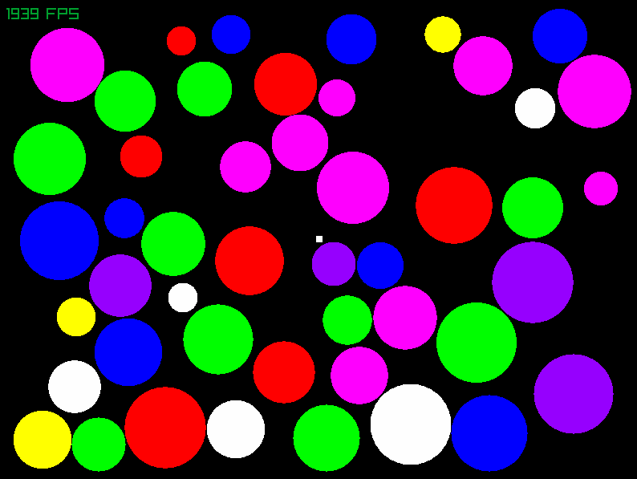

# Graphical Test Application




# Installation
[.NET 5.0](https://dotnet.microsoft.com/download/dotnet) or later must be installed before continuing.

 - Open `MathsForGames.sln` in a supported IDE (*<b>Visual Studio 2019</b> is preferred*).
 - Set configuration to `Release` for the best performance.
 The `Debug` configuration enables visuals for physics colliders, but is less performant.
 - Build the desired executable (`TankGame` or `PhysicsTest`).
	- `TankGame` copies `TankGame/Assets/` to the output directory.


### Dependencies
[Raylib-cs](https://www.nuget.org/packages/Raylib-cs/) is the only external dependency for the solution and is installed via NuGet package manager.

Visual Studio should automatically install the package upon opening the solution,
if it doesn't you will have to install it via the NuGet package manager or .NET CLI.

# Controls
Default controls are as follows:

#### Player 1
```js
// Tank
Forward 		W
Backward		S

Rotate Right	D
Rotate Left		A

// Turret
Rotate Right	E
Rotate Left 	Q

Shoot			SPACE
```

#### Player 2
```js
// Tank
Forward 		Up Arrow
Backward		Down Arrow

Rotate Right	Right Arrow
Rotate Left		Left Arrow

// Turret
Rotate Right	APOSTROPHE
Rotate Left 	L

Shoot			SEMICOLON
```

# Known Issues
 - Due to a limitation in the amount of sounds that can be played simultaneously, some sounds can get stopped if many are playing at once.
 - The physics implementation uses *very* basic collision responses and can be buggy at times
    (*e.g. Tanks clipping past outside wall, rectangle->circle collisions behaving unnaturally*).

# License
This project is provided under the [MIT License](./license.txt)